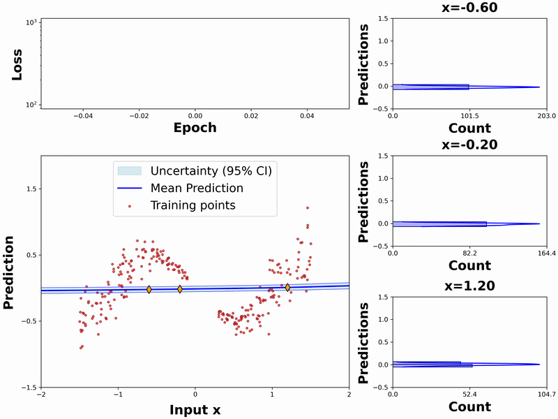

## Bayes by backprop demo
A simple pytorch implementation of a variational neural network with the Bayes by backprop algorithm. [1]

Once running the code `BNN_video.py`, a folder with different frames will be created in your system, and then the 
following video will be displayed:

## References
[1] Pawlowski, Nick, Andrew Brock, Matthew CH Lee, Martin Rajchl, and Ben Glocker. "Implicit weight uncertainty in neural networks." arXiv preprint arXiv:1711.01297 (2017).

